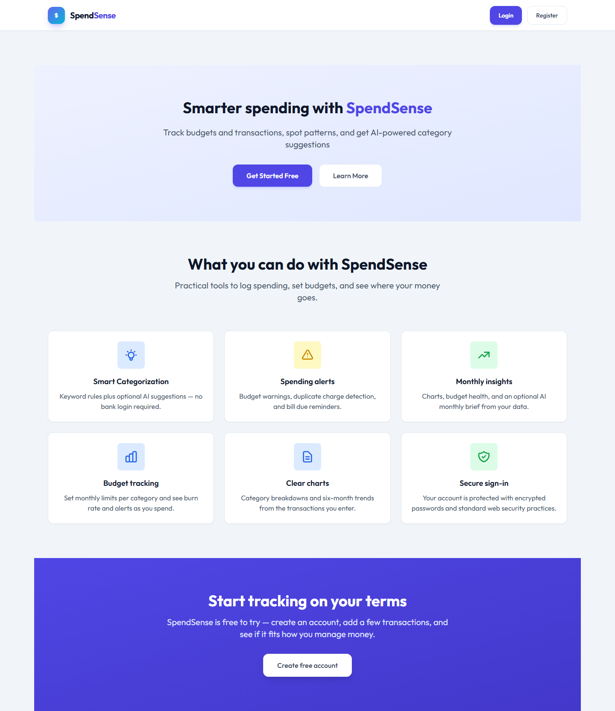
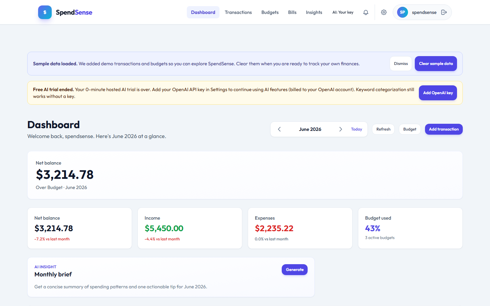
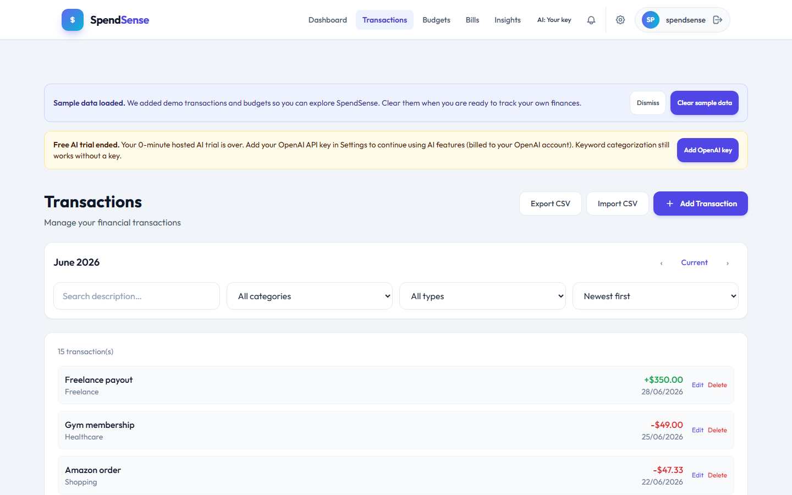
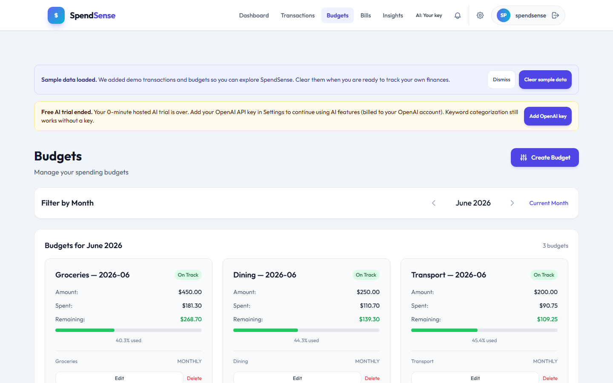
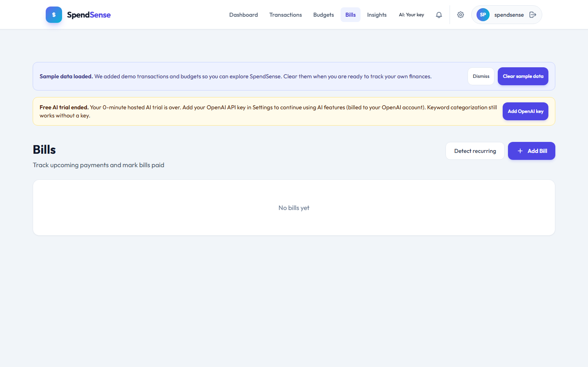
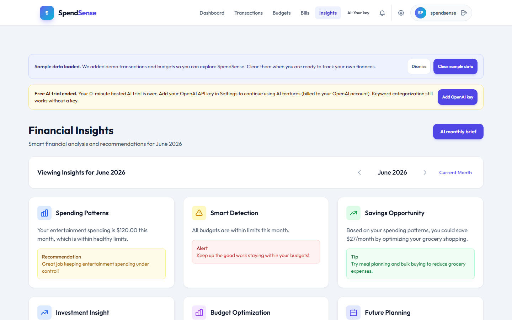
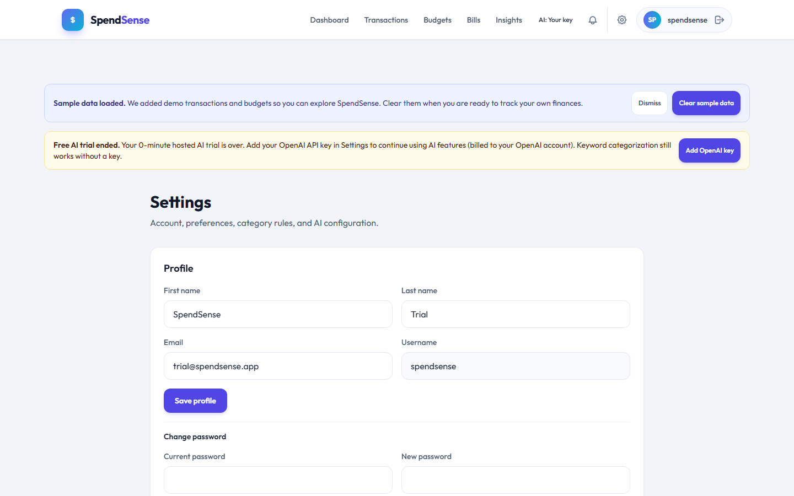
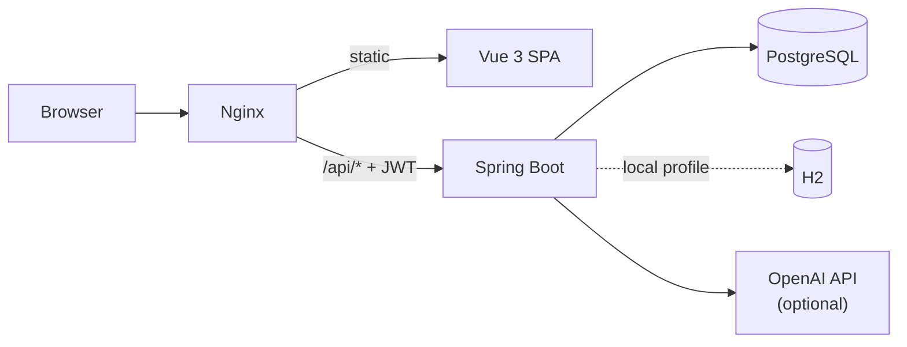

# SpendSense

**SpendSense** is a production-ready personal finance web app: track income and expenses, set category budgets, manage recurring bills, and optionally use OpenAI for categorization, receipt parsing, and monthly briefs.

**Live demo:** [spendsense-ffbi.onrender.com](https://spendsense-ffbi.onrender.com)  
**Repository:** [github.com/vishtechie07/ai-personal-finance-manager](https://github.com/vishtechie07/ai-personal-finance-manager)

Ships as one **Docker image** (Vue 3 + Spring Boot + Nginx) backed by **PostgreSQL** on Render. Local dev uses **H2** or Docker Compose.

| | |
|---|---|
| **Try it** | Register free, or demo login `spendsense` / `TrySpend2026!` ([details](docs/DEMO_CREDENTIALS.md)) |
| **Stack** | Java 17 · Spring Boot 3 · Vue 3 · Pinia · Tailwind · Chart.js · Flyway |
| **Deploy** | Render (live), Railway-compatible profile, Docker Compose |

---

## Screenshots

Captured from the local dev stack with seeded demo data (`scripts/capture-screenshots.mjs`).

| Landing | Dashboard |
|:---:|:---:|
| [](docs/screenshots/home.png) | [](docs/screenshots/dashboard.png) |

| Transactions | Budgets | Bills |
|:---:|:---:|:---:|
| [](docs/screenshots/transactions.png) | [](docs/screenshots/budgets.png) | [](docs/screenshots/bills.png) |

| Insights | Settings |
|:---:|:---:|
| [](docs/screenshots/insights.png) | [](docs/screenshots/settings.png) |

---

## Why this project

- **End-to-end product** — auth, CRUD, charts, alerts, settings, and deploy config, not a tutorial todo list.
- **Production-shaped** — JWT security, Flyway migrations, rate limits, encrypted BYOK keys, health checks, Render blueprint.
- **AI done responsibly** — user keys first, optional gated platform trial, quotas, keyword fallback when no key.
- **Honest UX** — marketing homepage states what is built; onboarding wizard and sample data help first-run evaluation.

---

## Features

### Money management
- **Transactions** — monthly views, search/filter/sort, CSV import/export, quick add from dashboard.
- **Budgets** — per-category monthly limits; spent totals sync from expenses; dashboard health and ≥90% alerts.
- **Bills** — recurring bills, due-soon list, mark paid, detect recurring patterns from history.
- **Insights** — category and trend charts, month-over-month KPIs, month-end expense forecast.

### Accounts & security
- Username/password (BCrypt) and **Sign in with Google** ([setup](docs/GOOGLE_SIGNIN.md)).
- Profile editing, password change, account deletion.
- Signup rate limits, disposable-email blocking, per-user data isolation.

### Notifications & settings
- In-app bell for budget and bill alerts (`POST /notifications/sync`).
- **Settings** — profile, bill-reminder preferences, **category rules** (keyword → category), encrypted OpenAI key.

### AI (optional)
- Category suggestions, receipt extraction, **monthly brief** narrative.
- Resolution order: **your key** → platform key (if enabled) → keyword rules.
- On Render, optional **5-minute platform trial** per new account with nav countdown; demo user `spendsense` cannot use platform AI ([config](docs/OPENAI.md)).

New registrations can receive **three months of sample data** (same pattern as the demo account).

---

## Tech stack

| Tier | Technologies |
|------|----------------|
| **Backend** | Java 17, Spring Boot 3.2, Spring Security (JWT), Spring Data JPA, Flyway, Maven |
| **Frontend** | Vue 3, Pinia, Vue Router, Tailwind CSS, Chart.js, Vite |
| **Data** | H2 (local JVM), PostgreSQL 16 (Docker / Render) |
| **Deploy** | Multi-stage Dockerfile, Nginx reverse proxy, `render.yaml`, Docker Compose |

---

## Quick start

### Docker (closest to production)

```bash
cp .env.example .env
# JWT_SECRET must be ≥32 characters; APP_SEED_DEMO_ENABLED=true loads demo data
docker compose up --build
```

Open **http://localhost:8080** → sign in as `spendsense` / `TrySpend2026!`.

### Split dev (fast iteration)

**API (H2):**

```bash
cd backend
# Windows:  $env:SPRING_PROFILES_ACTIVE="local"
# macOS/Linux: export SPRING_PROFILES_ACTIVE=local
mvn spring-boot:run
```

**UI:**

```bash
cd frontend
npm install
npm run dev
```

App at **http://localhost:3000** (proxies `/api` → `:8080`).

**Refresh README screenshots** (with both servers running):

```bash
npm install playwright --no-save
npx playwright install chromium
node scripts/capture-screenshots.mjs
```

Troubleshooting empty dashboards, legacy `demo` users, and seed flags: **[docs/DEMO_CREDENTIALS.md](docs/DEMO_CREDENTIALS.md)**.

---

## Deploy

| Platform | Notes |
|----------|--------|
| **[Render](docs/RENDER_DEPLOY.md)** | Recommended — port **80**, health **`/api/actuator/health`**, `SPRING_PROFILES_ACTIVE=render` |
| **Railway** | Same image; profile `railway` + `DATABASE_URL` |
| **Blueprint** | Root [`render.yaml`](render.yaml) provisions Postgres + web service |

**Optional Render env vars:** `GOOGLE_CLIENT_ID`, `OPENAI_API_KEY` + `APP_PLATFORM_AI_ENABLED=true`, `APP_PLATFORM_AI_TRIAL_MINUTES=5`.

After rotating Postgres credentials, update **`DATABASE_PASSWORD`** on the web service (or re-link the database under Environment).

---

## Architecture

One container in production: Nginx on **:80** serves the Vue build and proxies `/api/*` to Spring Boot on **:8081**.



Spring profiles: `local` (H2), `render` (Postgres env vars), `railway` (JDBC URL). Schema changes ship via **Flyway** — see [docs/DATABASE_MIGRATIONS.md](docs/DATABASE_MIGRATIONS.md).

---

## API

Base path: **`/api`**. Authenticated routes use `Authorization: Bearer <token>`.

| Area | Key routes |
|------|------------|
| **Auth** | `POST /auth/login`, `/register`, `/google` · `GET/PATCH /auth/me` · `DELETE /auth/me` |
| **Transactions** | CRUD · month/range queries · `GET /export` · `POST /import` |
| **Budgets & bills** | CRUD · `GET /bills/due-soon` · `GET /bills/detect-recurring` · `POST /bills/{id}/mark-paid` |
| **Notifications** | List · unread count · sync · mark read |
| **AI** | `POST /ai/suggest-category`, `/extract-receipt`, `/monthly-brief` |
| **Settings & rules** | `GET/PUT /settings` · category rules CRUD · OpenAI key save/delete |
| **Health** | `GET /actuator/health` |

Receipt uploads: `POST /transactions/{id}/receipt`. Public config (Google client ID flag): `GET /config/public`.

---

## Documentation

| Doc | Contents |
|-----|----------|
| [RENDER_DEPLOY.md](docs/RENDER_DEPLOY.md) | Render setup, env vars, troubleshooting |
| [OPENAI.md](docs/OPENAI.md) | BYOK, platform trial, quotas |
| [GOOGLE_SIGNIN.md](docs/GOOGLE_SIGNIN.md) | Google OAuth setup |
| [DATABASE_MIGRATIONS.md](docs/DATABASE_MIGRATIONS.md) | Flyway workflow |
| [DEMO_CREDENTIALS.md](docs/DEMO_CREDENTIALS.md) | Trial account and seed behavior |

Design tokens and dashboard IA: [`.stitch/DESIGN.md`](.stitch/DESIGN.md).

---

## Roadmap (not built yet)

Multi-currency · bank sync · object storage for receipts · email/push delivery · household accounts · PWA/E2E test suite.

---

## Support

Questions or bugs: [open an issue](https://github.com/vishtechie07/ai-personal-finance-manager/issues).
