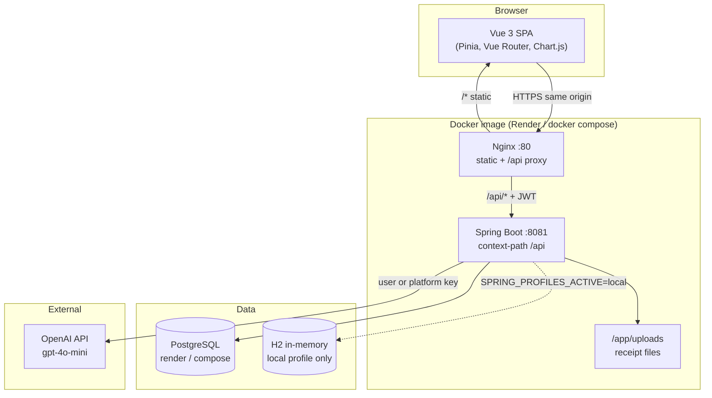
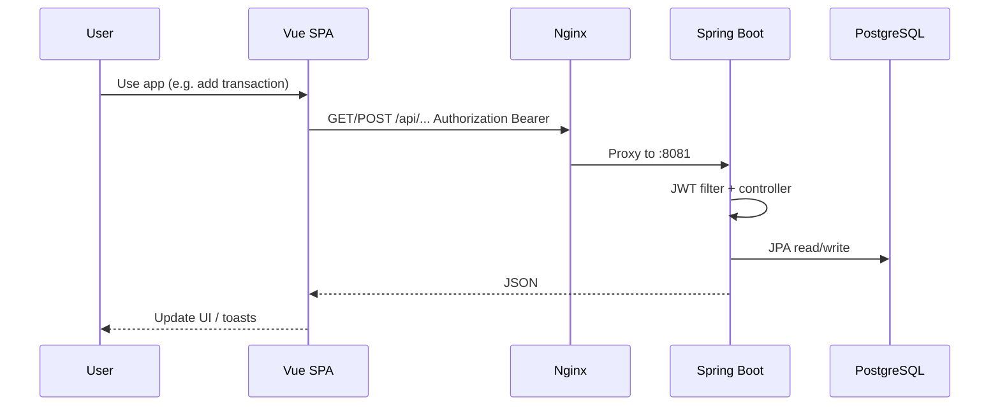

# SpendSense

**SpendSense** is a full-stack personal finance web app: track income and expenses, manage category budgets and recurring bills, get in-app alerts when budgets run hot or bills are due, and optionally use AI for category suggestions and receipt scanning.

Built for solo users and demos. Ships as a **single Docker image** (Vue UI + Spring Boot API + Nginx) with **PostgreSQL** in production and **H2** for local JVM development.

**Repository:** [github.com/vishtechie07/ai-personal-finance-manager](https://github.com/vishtechie07/ai-personal-finance-manager)

---

## What SpendSense does

| Area | Capability |
|------|------------|
| **Accounts** | Register, JWT login, per-user data isolation |
| **Transactions** | CRUD, monthly views, search/filter/sort, quick-add from dashboard |
| **Budgets** | Monthly limits by category; spent amount synced from expenses; progress and “attention” on dashboard |
| **Bills** | Recurring bills, due-soon list, mark paid (optional linked expense) |
| **Notifications** | In-app bell: budget ≥90% used, bills due within 7 days (sync on demand) |
| **Receipts** | Attach image/PDF to a transaction; optional OpenAI extraction of amount/date/merchant |
| **AI** | Category suggestion from description; user API key (encrypted) or platform `OPENAI_API_KEY`; keyword fallback when no key |
| **Insights** | Charts and summaries computed in the UI from your transaction data |

New registrations receive the same style of **multi-month sample data** as the seeded trial account (see [docs/DEMO_CREDENTIALS.md](docs/DEMO_CREDENTIALS.md)).

---

## Architecture

Production and local Docker run one container. The browser talks only to **Nginx on port 80**; Nginx serves the Vue build and proxies `/api/*` to Spring Boot on **8081**.



### Request flow (authenticated)



### Backend layout

| Layer | Responsibility |
|-------|----------------|
| `controller` | REST: auth, transactions, budgets, bills, notifications, receipts, settings, AI |
| `service` | Business logic, `BudgetSpentSyncService`, `NotificationSyncService`, `OpenAiKeyResolver` |
| `repository` | Spring Data JPA (+ `TransactionSpecifications` for filters) |
| `model` | `User`, `Transaction`, `Budget`, `Bill`, `AppNotification`, `ReceiptAttachment` |
| `config` | Security, JWT, CORS, seed runner, storage paths |

### Spring profiles

| Profile | Database | Typical use |
|---------|----------|-------------|
| `local` | H2 | `mvn spring-boot:run`, trial seed + consolidate legacy users |
| `render` | PostgreSQL env vars | Render, `docker compose` |
| `railway` | `DATABASE_URL` JDBC | Railway-style hosting |

---

## Features (current)

### Core
- JWT authentication (BCrypt passwords)
- Transactions with categories and types (income/expense)
- Monthly budgets with automatic **spent** sync from expenses
- Dashboard: summaries, budget health, due bills, quick-add transaction

### Bills & alerts
- Bill CRUD and **mark paid**
- Notification sync: high budget usage and upcoming due dates
- Notification bell with unread count

### AI & receipts
- **Category suggestion**: `POST /api/ai/suggest-category`
- **Receipt upload** per transaction; **AI extract** when a key is available
- Key resolution: user key → platform `OPENAI_API_KEY` → keyword fallback ([docs/OPENAI.md](docs/OPENAI.md))

### UX
- SpendSense branding, glass-style UI, horizontal action buttons
- Toast errors for API failures; fixed register page (`<script setup>`)

---

## Tech stack

| Tier | Technologies |
|------|----------------|
| **Backend** | Java 17, Spring Boot 3.2, Spring Security (JWT), Spring Data JPA, Maven |
| **Frontend** | Vue 3, Pinia, Vue Router, Tailwind CSS, Chart.js, Vite |
| **Data** | H2 (dev), PostgreSQL 16 (prod) |
| **Deploy** | Multi-stage Dockerfile, Nginx, Render Blueprint (`render.yaml`), Docker Compose |

---

## Quick start

### Option A — Docker (matches Render)

```bash
cp .env.example .env
# Set JWT_SECRET (≥32 characters) and optionally OPENAI_API_KEY
docker compose up --build
```

Open **http://localhost:8080** and sign in with the [trial account](docs/DEMO_CREDENTIALS.md).

### Option B — Split dev (H2 + Vite)

**Terminal 1 — API**

```bash
cd backend
# Windows: set SPRING_PROFILES_ACTIVE=local
# Linux/macOS: export SPRING_PROFILES_ACTIVE=local
mvn spring-boot:run
```

- API: http://localhost:8080/api  
- H2 console: http://localhost:8080/api/h2-console (`jdbc:h2:mem:financedb`, user `sa`, password `password`)

**Terminal 2 — UI**

```bash
cd frontend
npm install
npm run dev
```

- App: http://localhost:3000 (Vite proxies `/api` to the backend)

### Trial login & sample data

| Field | Value |
|-------|--------|
| Username | `spendsense` |
| Password | `TrySpend2026!` |

Details: **[docs/DEMO_CREDENTIALS.md](docs/DEMO_CREDENTIALS.md)**

If an old `demo` user exists in Postgres, wipe the volume (`docker compose down -v`) or set `APP_SEED_CONSOLIDATE_LEGACY_USERS=true` once and redeploy.

---

## Deploy

| Platform | Guide |
|----------|--------|
| **Render** (recommended) | [docs/RENDER_DEPLOY.md](docs/RENDER_DEPLOY.md) — port **80**, health **`/api/actuator/health`**, `SPRING_PROFILES_ACTIVE=render` |
| **Railway** | Same Docker image; profile `railway` + `DATABASE_URL` — see `application-railway.yml` |
| **Blueprint** | Root `render.yaml` provisions Postgres + web service `spendsense` |

Optional: platform **`OPENAI_API_KEY`** in Render for trials without per-user keys.

---

## API overview

Base path: `/api`. Authenticated routes require `Authorization: Bearer <token>`.

### Auth
| Method | Path | Description |
|--------|------|-------------|
| POST | `/auth/login` | Login |
| POST | `/auth/register` | Register (+ sample data seed) |
| GET | `/auth/me` | Current user |

### Transactions
| Method | Path | Description |
|--------|------|-------------|
| GET | `/transactions` | List all |
| GET | `/transactions/month/{yearMonth}` | Month list (query: search, category, type, sort) |
| GET | `/transactions/current-month` | Current month |
| GET | `/transactions/range` | Date range |
| POST/PUT/DELETE | `/transactions`, `/transactions/{id}` | CRUD |

### Budgets
| Method | Path | Description |
|--------|------|-------------|
| GET | `/budgets`, `/budgets/month/{yearMonth}`, `/budgets/current-month` | List |
| POST/PUT/DELETE | `/budgets`, `/budgets/{id}` | CRUD |
| PUT | `/budgets/{id}/spent` | Update spent (usually synced automatically) |

### Bills
| Method | Path | Description |
|--------|------|-------------|
| GET | `/bills`, `/bills/due-soon` | List / upcoming |
| POST/PUT/DELETE | `/bills`, `/bills/{id}` | CRUD |
| POST | `/bills/{id}/mark-paid` | Mark paid |

### Notifications
| Method | Path | Description |
|--------|------|-------------|
| GET | `/notifications`, `/notifications/unread-count` | List / count |
| POST | `/notifications/sync` | Generate from budgets & bills |
| PATCH | `/notifications/{id}/read` | Mark read |
| POST | `/notifications/read-all` | Mark all read |

### Receipts & AI
| Method | Path | Description |
|--------|------|-------------|
| POST | `/transactions/{id}/receipt` | Upload receipt |
| GET/DELETE | `/transactions/{id}/receipt`, `.../meta` | Download / metadata / delete |
| POST | `/ai/extract-receipt` | AI parse uploaded receipt |
| POST | `/ai/suggest-category` | Suggest category from description |

### Settings
| Method | Path | Description |
|--------|------|-------------|
| GET | `/settings` | `hasOpenAiApiKey`, `platformAiEnabled`, `aiAvailable` |
| PUT/DELETE | `/settings/openai-api-key` | Save or remove user OpenAI key |

Health: `GET /api/actuator/health`

---

## Project structure

```
ai-personal-finance-manager/
├── backend/                 # Spring Boot API
├── frontend/                # Vue 3 SPA
├── nginx/default.conf       # Reverse proxy rules
├── docker/
│   └── entrypoint.sh        # Starts Spring + Nginx
├── Dockerfile               # Multi-stage production image
├── docker-compose.yml       # Local Postgres + app
├── render.yaml              # Render Blueprint
├── docs/
│   ├── RENDER_DEPLOY.md
│   ├── OPENAI.md
│   └── DEMO_CREDENTIALS.md
├── .env.example
└── README.md
```

---

## Data model

| Entity | Purpose |
|--------|---------|
| **User** | Auth; optional encrypted OpenAI API key |
| **Transaction** | Amount, category, type, date, description |
| **Budget** | Category limit and spent for a month |
| **Bill** | Recurring obligation, due date, paid flag |
| **AppNotification** | In-app alerts (budget / bill rules) |
| **ReceiptAttachment** | File metadata linked to a transaction |

---

## Future scope & enhancements

Planned or natural next steps (not implemented yet):

| Theme | Ideas |
|-------|--------|
| **Production hardening** | Rate limits on auth and AI; disable or rotate public trial account; audit logging |
| **Storage** | S3/R2 for receipts (Render disk is ephemeral); virus scan on uploads |
| **Finance depth** | Multi-currency, recurring transactions, goals, CSV import/export |
| **AI** | Smarter insights narrative, anomaly detection, batch categorization |
| **Notifications** | Email/push (SendGrid, FCM), user preferences per alert type |
| **Collaboration** | Household accounts, shared budgets |
| **Mobile** | PWA offline shell or React Native client |
| **Observability** | Structured logging, metrics, error tracking (e.g. Sentry) |
| **Testing** | API integration tests, Playwright E2E for critical flows |

Contributions welcome via issues and pull requests.

---

## Documentation

- [Render deployment](docs/RENDER_DEPLOY.md)
- [OpenAI configuration](docs/OPENAI.md)
- [Trial / seed credentials](docs/DEMO_CREDENTIALS.md)

---

## License

MIT License — see repository license file if present.

## Support

Open an issue on [GitHub](https://github.com/vishtechie07/ai-personal-finance-manager/issues).
